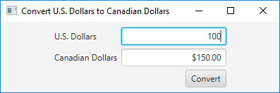

# Currency Converter

Create a window that lets users enter a U.S. dollar amount and convert it into Canadian dollars.

## Example Output

## Analysis Steps

Create a pane with two TextFields that have labels and a Convert button. Create an action handler that converts the US dollars into Canadian dollars.

### Design

I created a TextField for the US Dollars field and the Canadian Dollars field. I also created a Convert button. Then I created a GridPane and added the TextFields, Labels for the fields, and the Convert button. I made the Canadian Dollars field read-only. In my action handler for the Convert button, I pulled in the US Dollars value, calculated the conversion, and set the result as the value for the Canadian Dollars field. To make it keyboard-friendly, I also added an action handler that allows users to just press Enter after entering the US Dollar amount. That way they have the option of clicking Convert or pressing Enter.

### Testing

1. Enter a numeric value in the U.S. Dollars field.
2. Verify that the Canadian Dollars doesn't let you enter a value.
3. Click Convert, and verify that the correct amount appears in the Canadian Dollars field (1.5 * the amount entered in the US Dollars field).
4. Enter a different numeric value in the U.S. Dollars field, and then press Enter.
5. Verify that the correct amount appears in the Canadian Dollars field.

## Do not change content below this line
## Adapted from a README Built With

* [Dropwizard](http://www.dropwizard.io/1.0.2/docs/) - The web framework used
* [Maven](https://maven.apache.org/) - Dependency Management
* [ROME](https://rometools.github.io/rome/) - Used to generate RSS Feeds

## Contributing

Please read [CONTRIBUTING.md](https://gist.github.com/PurpleBooth/b24679402957c63ec426) for details on our code of conduct, and the process for submitting pull requests to us.

## Versioning

We use [SemVer](http://semver.org/) for versioning. For the versions available, see the [tags on this repository](https://github.com/your/project/tags). 

## Authors

* **Billie Thompson** - *Initial work* - [PurpleBooth](https://github.com/PurpleBooth)

See also the list of [contributors](https://github.com/your/project/contributors) who participated in this project.

## License

This project is licensed under the MIT License - see the [LICENSE.md](LICENSE.md) file for details

## Acknowledgments

* Hat tip to anyone who's code was used
* Inspiration
* etc
