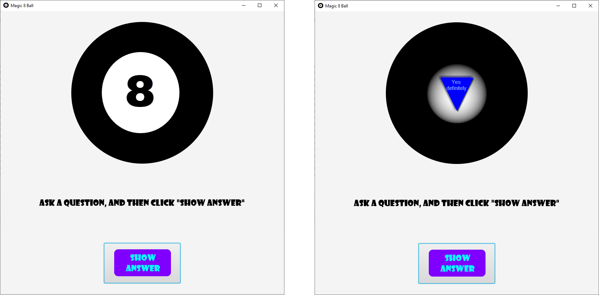

# Magic 8 Ball

Create a Magic 8 Ball to help you find answers to all of life's questions.

## Example Output

## Analysis Steps

Using JavaFX, create a GUI for the Magic 8 Ball. In a separate class, create all possible answers. This class creates an ArrayList for the answers, as well as a method that randomly chooses and returns an answer from the ArrayList.

### Design

I first created the GUI for the Magic 8 Ball. The root pane is a VBox pane that holds the ball, brief instructions for the user, and a button to generate an answer. When the user first opens the program, it displays an initial pane. This pane shows the back of the Magic 8 Ball. When the Show Answer button is clicked, a new image is added to the pane. To prevent images from stacking on each other in the pane, I used a try/catch to clear the pane each time. This also works to clear the initial pane from the root pane. 

All possible answers are in an image format. To add all the answers to an array, I created an Image ArrayList. Then I created a returnAnswer method. In this method, I used a for loop to add all image files to the ArrayList. To simplify this process, I created the image filenames so that they were numerical. The downfall is that the image names aren't descriptive. Then I used the Math.random() class to randomly select an index and return the image at that index.

In the Magic 8 Ball class, an event handler for the Show Answer button uses the returnAnswer method from the PossibleAnswers class to add the returned image to the pane.

### Testing

1. Run the program.
2. Verify that the initial pane showing the back of the Magic 8 Ball appears.
3. Verify that the text "Ask a question, and then click "Show Answer"" appears below the Magic 8 Ball.
4. Verify that a "Show Answer" button appears at the bottom.
5. Click "Show Answer".
6. Verify that the initial pane is removed, a new pane appears showing the "front" of the Magic 8 Ball and displays an answer.
7. Click "Show Button" several more times, and verify that new answer appears each time.

## Do not change content below this line
## Adapted from a README Built With

* [Dropwizard](http://www.dropwizard.io/1.0.2/docs/) - The web framework used
* [Maven](https://maven.apache.org/) - Dependency Management
* [ROME](https://rometools.github.io/rome/) - Used to generate RSS Feeds

## Contributing

Please read [CONTRIBUTING.md](https://gist.github.com/PurpleBooth/b24679402957c63ec426) for details on our code of conduct, and the process for submitting pull requests to us.

## Versioning

We use [SemVer](http://semver.org/) for versioning. For the versions available, see the [tags on this repository](https://github.com/your/project/tags). 

## Authors

* **Billie Thompson** - *Initial work* - [PurpleBooth](https://github.com/PurpleBooth)

See also the list of [contributors](https://github.com/your/project/contributors) who participated in this project.

## License

This project is licensed under the MIT License - see the [LICENSE.md](LICENSE.md) file for details

## Acknowledgments

* Hat tip to anyone who's code was used
* Inspiration
* etc
